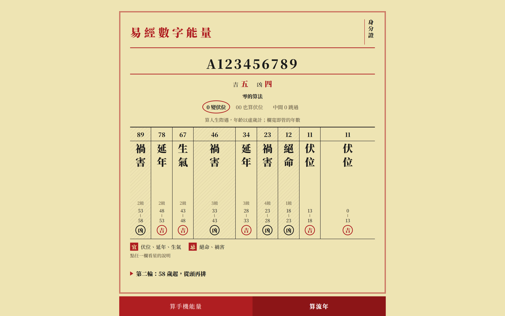
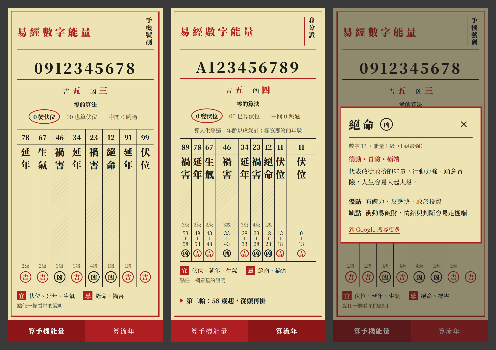

# yijingnumber
用易經計算您的數字能量。

Demo網頁:https://zhaohoulin.github.io/yijinnumber/#/

## 執行畫面




## 開發

技術：Vue 3 + Vite（模板 pug、樣式 stylus），計算邏輯集中在 `src/yijing.js`。

```
npm install
npm run dev      # 開發伺服器，網址 /yijinnumber/
npm test         # 計算邏輯測試（含與原版演算法的對照）
npm run lint
npm run build    # 輸出到 dist/
sh deploy.sh     # 建置並推到 gh-pages
```
